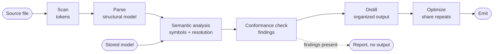

# Core Domain Distillation — Tiferet Dialect Compiler

**Status:** Frozen for reconstruction · **Domain:** `compiler` · **Code:** `compiler/` · **Branch:** `main`
**Companion:** `docs/compiler/domain-vision.md`
**Catalog freeze:** `TTC1-FREEZE-001`

## 1. Purpose of this document

The vision statement says *what* the compiler is for. This document says *how the
domain actually works*: the vocabulary, the behaviors, the rules those behaviors
enforce, and the way the pieces relate. It is the reference a contributor should
read before changing the pipeline, and the reference a reviewer should read before
judging whether a change belongs.

It is written to be legible to non-implementers as well. Where a technical term is
unavoidable, it is defined once and then used consistently.

## 2. The core domain, restated precisely

The compiler's core domain is **verifying and distilling declared structure in
Tiferet source**.

A Tiferet source file is not just code. It carries structural markers that declare
what the file is composed of and what role each part plays. The compiler treats
those markers as **grammar**, not as commentary. From them it builds a single
structural model of the file, verifies that model against the rules for that kind
of building block, and then distills the model into organized data.

The domain has exactly one shape:

> **Read** → **Model** → **Verify** → **Distill**

and exactly two axes of variation:

1. **Internal rules** — what a given kind of building block must contain, and how
   its parts must be named and shaped.
2. **Relationship rules** — which *other* kinds of building block this one is
   permitted to depend on.

Everything else — recognizing markers, tracking indentation, building the model,
naming and scoping its contents, resolving references, serializing the result — is
identical for all ten kinds. That asymmetry is the single most important fact about
this domain, and Section 8 treats it directly.

## 3. Ubiquitous language

**Component type** — one of Tiferet's ten kinds of building block: `assets`,
`blueprints`, `contexts`, `di`, `domain`, `events`, `interfaces`, `mappers`,
`repos`, `utils`.

**Dialect** — the structural conventions a given component type is written in.
One grammar, ten dialects.

**Artifact** — a declared structural unit in the source, introduced by a marker.
Three tiers:
- **Group** (`# *** imports`) — the top-level division of a file.
- **Section** (`# ** event: ping`) — a named unit inside a group, usually one class
  or one function.
- **Member** (`# * method: execute`) — a part of a section: an attribute, an
  initializer, or a method.

**Snippet** — one logical step inside a method: a leading comment plus the
statements it describes. Snippets are modeled explicitly, with the comment kept
separate from the code it introduces.

**Annotation** — an inline structured note (`# -- obsolete: ...`, `# ++ todo:
...`) attached to an artifact rather than discarded as a comment.

**Token** — the smallest recognized unit of source text.

**AST (structural model)** — the tree the compiler builds from tokens. Its nodes
are declarations, statements, expressions, and types, with artifact tiers as
first-class node kinds.

**Symbol** — a named thing the file defines or imports: a class, a method, an
attribute, a parameter, an import.

**Scope** — a region that owns symbols (module, class, method), identified by a
dotted path such as `module.Ping.execute`.

**Symbol table** — the complete set of scopes and their symbols for a file.

**Resolution** — deciding, for each name the file *uses*, which symbol it refers
to. Names that match nothing are recorded as unresolved.

**Conformance rule** — a requirement the source must satisfy to be a valid member
of its component type.

**Distillation (codegen)** — turning the verified model into organized output data
describing the component.

## 4. What the compiler reads

The dialect adds a small, deliberate vocabulary on top of Python. The scanner
recognizes it directly (`compiler/assets/lexer.py`):

- Group, section, and member markers — the three artifact tiers.
- Annotation markers — obsolete and todo notes.
- Docstrings, in RST form, as the declared intent of a module, class, or method.
- Ordinary line comments, which become snippet comments when they lead code.
- The full set of Python keywords, operators, and delimiters needed to model real
  implementation code.

Two structural conventions matter especially, because they are where the compiler
gets its leverage:

**Import grouping.** A file's imports are divided into declared groups — `core`
(standard library), `infra` (third-party), and `app` (other Tiferet components).
The `app` group is the file's statement of what else in the system it depends on.
This is the raw material for all relationship checking.

**Name concordance.** A section header names its unit in one style; the code
inside must agree. `# ** event: get_feature` requires a class `GetFeature`;
`# * method: execute` requires a `def execute`. Declared intent and actual code are
checked against each other rather than trusted.

## 5. The six behaviors

Each behavior is a bounded step with a defined input and output. Each is exposed
as a domain event, and pipelines are composed from them in
`compiler/assets/feature.yml`. Heavy lifting lives in injected services behind
interfaces (`compiler/interfaces/`), so any step can be replaced without touching
the others.

### 5.1 Lexical scanning
*Turn source text into tokens.*

`PerformLexicalAnalysis` (`compiler/events/lexer.py`) reads the file and delegates
to the lexer service (`compiler/utils/lexer.py`). Beyond ordinary tokenizing, it
does two dialect-specific things: it emits artifact markers and annotations as real
tokens instead of discarding them as comments, and it injects explicit
indent/dedent tokens so that block structure — including artifact nesting — becomes
unambiguous downstream. `EmitScanResult` renders the token stream for inspection.

**This step is fully component-agnostic.** Markers look the same in every dialect.

### 5.2 Syntactic parsing
*Turn tokens into one structural model.*

`PerformSyntacticAnalysis` (`compiler/events/parser.py`) drives the parser service
(`compiler/utils/parser.py`, a thin adapter over `tiferet_ly.utils.parse.PlyParser`
driven by the declared grammar in `compiler/assets/productions.yml`) to produce the
model defined in `compiler/domain/ast.py`, extended by `compiler/domain/artifact.py`.

The model is deliberately Tiferet-aware rather than a generic Python tree:

- Artifact groups and sections are their own statement kind, with the header
  declaration attached to the node it introduces.
- Members carry their role explicitly — attribute, init, or method — instead of
  being inferred from position.
- Snippets keep their leading comments in a separate field from their code, so the
  pairing of intent and implementation is preserved rather than flattened.
- Annotations are attached to the artifact they describe.

Sibling sequences are ordinary lists at run time. A chained representation exists
only for persistence, handled by transfer objects in
`compiler/mappers/transfer.py`, which convert between the two on the way to and
from stored JSON. `EmitParseResult` serializes the model; `LoadFromAST` reads it
back, allowing later stages to run on a stored model instead of re-parsing source.

**This step is fully component-agnostic.** Every dialect uses the same tiers,
members, and snippets.

A helper in `compiler/utils/parser.py` with no Tiferet-dialect coupling (e.g.
`make_position_helpers`, a generic PLY lexpos/lineno position-tracking
utility) carries a standardized `# UPSTREAM CANDIDATE (tiferet-ly): ...`
comment banner above its `# ** function:` header, flagging it as a future
migration candidate once tiferet-ly has a stable home for it.

### 5.3 Semantic analysis
*Establish what the file defines and what its references mean.*

`PerformSemanticAnalysis` (`compiler/events/semantic.py`) runs two passes over the
model (`compiler/utils/semantic.py`).

The **symbol table builder** walks the model, opening a scope for each module,
class, and method, and registering every symbol it encounters — imported names
with the module they came from, classes with their base class, methods with their
return type, parameters with their annotations, and attributes, including those
assigned through `self`. Artifact groups, sections, members, and snippets are
transparent to scoping: they are structural, not lexical, so the builder descends
through them without creating scopes. The result is a flat registry of scopes keyed
by dotted path (`compiler/domain/semantic.py`, `compiler/mappers/semantic.py`).

The **name resolver** then walks the model a second time, and for every name *used*
finds the nearest scope that defines it — walking outward from the current scope to
the module, with `self.x` references resolved against the enclosing class. Each
lookup is recorded as resolved (with the scope it resolved to) or unresolved.

**This step is component-agnostic in mechanism**, and it is also where
relationship checking becomes possible: the resolved import symbols, together with
their source modules, are precisely the evidence needed to judge cross-component
dependencies (Section 7).

### 5.4 Conformance and type checking
*Verify that the file is a valid instance of what it claims to be.*

`PerformTypeCheck` (`compiler/events/typecheck.py`) reconstructs the scopes and
runs the checker (`compiler/utils/typecheck.py`). Component type is an **input**
to this step (`-c/--component` on the semantic-bearing commands): the walker is
one `ConformanceChecker`, parameterized by a rule set selected for the requested
type. Findings are **collected** rather than failing on the first one. Each
finding carries a code, a message, the scope path, and a line/column where
available (`compiler/domain/typecheck.py`, `compiler/mappers/typecheck.py`).

The walker is a `StatementWalker` (`compiler/utils/core.py`). Attachments are
callables: `Attachment.__call__(candidate, context)` is the host invocation.
Kind 1 specifications still implement `evaluate`, Kind 2 productions and Kind 3
rewrites still implement `apply`; hosts do not choose among those names. The
`attaches_to` dispatch loop lives on the walker. Aggregates do not `accept` a
visitor and do not import utils.

The rule catalogue has a component-agnostic family and a per-dialect family:

**Common (every component type).** The imports group may only contain `core`,
`infra`, and `app`, and each of those may contain only import statements. A named
section must contain the unit it advertises, with the matching name. An attribute
member must be a variable declaration; a method member must be a function, must
take `self` first, and must declare a recognized return type. Assignments and
arithmetic are checked shallowly against declared and inferred types.

**Dialect (selected by component type).** Permitted tier-1 groups, `app`-import
relationship rules, and required-base rules are parameterized Kind 1
specifications (`PermittedGroupSpecification`, `AppImportSpecification`,
`RequiredBaseSpecification`) constructed with dialect data rather than copied
classes. Unique rules stay their own classes: event `execute`, domain `Field(...)`,
repos CRUD vocabulary, utils context-manager pairing, interface/DI abstract-method
shape.

### 5.5 Distillation
*Turn the verified model into organized output data.*

`GenerateCode` (`compiler/events/codegen.py`) delegates to the generator
(`compiler/utils/codegen.py`), which walks the model and emits a structured
description of the component: its name and documented intent, its imports
collapsed by source module and grouped as declared, its module-level functions,
and its sections with their attributes, injected dependencies, methods,
parameters, return descriptions, and snippets. Accumulators in
`compiler/mappers/codegen.py` build these collections; the shapes they produce are
defined in `compiler/domain/codegen.py`.

**This is the one step whose output shape is genuinely component-specific.** The
walking machinery is generic; the vocabulary of the result is not. Today it emits
an event-group shape (`compiler/utils/codegen.py (46-80)`), keyed for events and
functions.

### 5.6 Optimization and emission
*Compact the output, then write it.*

`OptimizeCode` runs the optimizer (`compiler/utils/optimizer.py`), which finds
repeated parameter and return structures across the output and replaces them with
shared references, hoisting them into a declarations section so the serialized form
can use anchors and aliases instead of repeating itself. `EmitCodegenResult` writes
the result; `compiler/utils/output.py` handles format selection and
`compiler/utils/printer.py` renders models and symbol tables for human inspection.

Optimization is mechanically generic but currently reaches into the event-group
shape to find what it should compact.

## 6. How the behaviors compose

Pipelines are declared, not hard-coded (`compiler/assets/feature.yml`), and each
step names a service registered in `compiler/assets/config.yml`. Four pipelines
exist today, each a prefix of the next, so every stage is independently
observable:

- **scan** — tokens only.
- **parse** — tokens, then the structural model.
- **semantic** — plus the symbol table, resolution, and conformance findings.
- **compile** — plus distillation, optimization, and emission.
- **compile-from-model** — the same tail, starting from a stored model instead of
  source.

Steps hand results forward by named key, so a stage can be inserted, replaced, or
skipped by editing configuration.

## 7. Relationships between component types

Verifying a file in isolation is only half the domain. The other half is verifying
its **place in the system**.

Tiferet arranges the ten component types in three layers, and dependencies may
only run downward:

- **Accessor** — `assets`, `contexts`, `blueprints`
- **Actor** — `domain`, `events`, `di`
- **Infrastructure** — `interfaces`, `mappers`, `utils`, `repos`

Within that ordering, each type has a specific permitted set — this is the
relationship rulebook:

- `domain` depends on nothing in the framework. It is pure structure.
- `assets` is the root everyone may draw on and that draws on no one.
- `interfaces` may use `domain` and sibling interfaces.
- `events` — the hub of the Actor layer — may use `assets`, `domain`,
  `interfaces`, `mappers`, `di`, and `utils`, but never `contexts` or
  `blueprints`.
- `mappers` may use `domain` and `events`, and nothing else.
- `di` is deliberately event-free and asset-free: `domain` and the DI interface
  only.
- `utils` may use `interfaces` and `mappers`.
- `repos` may use `interfaces`, `mappers`, and `utils` — reaching `domain` through
  `mappers` rather than directly.
- `contexts` may use `assets`, `domain`, and `events`; `repos` and `utils` arrive
  by injection at run time, never by import.
- `blueprints` may use `assets`, `contexts`, `di`, and `events`, reaching domain
  models through contexts rather than importing them.

Three properties make these rules checkable by this compiler and by nothing else
in the toolchain:

1. **The evidence is already in the model.** Every dependency a file takes is a
   resolved import symbol with a recorded source module. Semantic analysis produces
   exactly this.
2. **The declared group carries intent.** Because imports are grouped into `core`,
   `infra`, and `app`, the compiler does not have to guess which imports are
   internal — the file says so.
3. **The judgment requires the component type.** A resolved import is valid or
   invalid depending on what kind of building block is doing the importing. The
   same import line is correct in one component type and a violation in another.

There are also **indirect-access rules**, which are relationship rules in a
stronger form: some dependencies are legitimate but must not be taken by import.
`contexts` genuinely needs repositories; it must receive them through injection.
Detecting "reached the right thing the wrong way" is a relationship check, not a
naming check, and it is only expressible once component type is known.

This is why the second question in the vision statement — *are this file's
connections permitted?* — is core domain rather than a lint pass bolted on
afterward. It uses the same model, the same symbol table, and the same finding
format as every other conformance rule. What it needs is one additional input:
the component type.

**A note on the rulebook's own accuracy.** The permitted sets above are the
system's architectural contract, and they are only as good as their source. The
framework's current architecture documentation lists `utils` as prohibited for
`events`, which is not correct — domain events legitimately consume utilities. That
discrepancy is recorded here and needs to be reconciled upstream in the framework
docs and in the architecture guidance derived from them. It also makes a design
point for this compiler: because the relationship rulebook will be enforced
mechanically, it must be maintained as a **single declared source of truth** that
documentation and checking both read from. A rulebook duplicated in prose and in
code will drift, and a drifting rulebook produces false findings — the fastest way
to lose a team's trust in the tool.

## 8. The agnostic core and the variable edge

Stated plainly, so that future work can be scoped against it:

**Agnostic — build once, never per component type:**
- Token recognition, including artifact markers and annotations.
- Indentation and block structure.
- The structural model: tiers, members, snippets, annotations, declarations,
  statements, expressions, types.
- Scope construction and symbol registration.
- Name resolution.
- Finding collection, with codes, messages, scope paths, and positions.
- The walking machinery used by conformance checking and distillation.
- Optimization mechanics, emission, and formatting.

**Variable — one definition per component type:**
- The internal rulebook: which sections are expected, what each must contain, what
  its members must look like, which are mandatory.
- The relationship rulebook: the permitted dependency set, plus which dependencies
  must be indirect.
- The distilled output vocabulary: what the organized result is called and how it
  is keyed.

**Currently settled — component type as input, relationship checking as Kind 1:**
- Semantic-bearing pipelines take the component type as request input
  (`-c/--component`). Feature ids, CLI command names, and `feature.yml` gating
  stay component-agnostic (`scan.module`, `parse.module`, `semantic.module`,
  `compile.module`, `compile.ast`).
- Dialect variation is constructor data on parameterized Kind 1 specifications,
  plus a small set of unique rule classes. The walking machinery does not branch
  on component type.
- Relationship checking exists: each dialect's `AppImportSpecification` judges
  the `app` import sub-group against that type's permitted dependency set
  (Section 7). Contexts/blueprints may also allow the framework-root `a` alias.
- The callable walker seam is the visitor: `StatementWalker.apply_attachments`
  calls matching attachments as `__call__`. `TiferetGenerator` is a second host
  tree (artifact groups / member roles) and also invokes rewrites as callables;
  it is not a `StatementWalker`.

**Still variable, not a new entanglement:** distilled output vocabulary remains
component-specific (`cmpt` envelope, with dual-emitted `evt_grp` for events).
Lexer and parser replacement are out of this seam (TTC1-RFP-012 / TTC1-RFP-013).

## 9. Boundaries

**Inside the domain:** recognizing the dialect, modeling it, verifying internal
conformance, verifying relationship conformance, distilling to organized output,
and reporting findings precisely.

**Outside the domain:**
- Executing components or resolving dependency injection at run time — the
  framework's concern.
- Organizing components into projects, storing them, and rendering source back out
  — the Composer's concern. The compiler's distilled output is the handoff.
- General-purpose static analysis or full type inference. Type reasoning here
  exists only to serve conformance.

## 10. Where this leads

Most of the seam named here is now in the code (TTC1-RFP-015 / #223):

1. **Component type as an input.** Done: one pipeline serves all ten dialects;
   the type arrives as request input, not as a command name.
2. **Rulebooks as first-class objects the walking machinery consumes.** Done as
   the callable attachment family in `compiler/utils`, not in domain: Kind 1
   `Specification`, Kind 2 `Production`, Kind 3 `Rewrite`. Hosts invoke
   `Attachment.__call__`. `StatementWalker` owns `attaches_to` dispatch.
   Parameterized Kind 1 families (`PermittedGroupSpecification`,
   `AppImportSpecification`, `RequiredBaseSpecification`) carry dialect data.
   Tree-shape queries (`encode`, `children`, `visit_role`, `flatten_call_args`)
   live on the domain AST types; mapper aggregates inherit them and do not import
   utils. This is not a YAML-declared rulebook and not `node.accept(visitor)`.
3. **Relationship checking as Kind 1 app-import specifications.** Done against
   the Section 7 permitted sets, reported in the existing finding format.
4. **A component-neutral distilled shape.** In progress: the `cmpt` envelope is
   the generalized form; events still dual-emit `evt_grp` for Composer.
5. **The remaining dialects as proof.** The ten component types have rule sets;
   unique rules stay separate classes. Lexer/parser replacement is TTC1-RFP-012
   / TTC1-RFP-013 and should consume this visitor seam rather than re-split it.

What remains is not a third cohesive form for applying rules. The compiler for
the vision statement's two questions — *is this file a valid instance of what it
claims to be?* and *are this file's connections permitted?* — now answers both
through the same walker.
