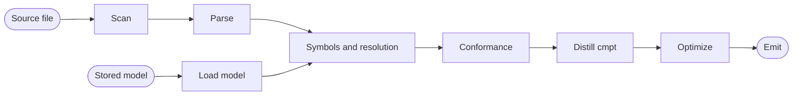

# Core Domain Distillation — ElohaSL

**Status:** Draft · **Domain:** `compiler` · **Code:** `tiferet_elsl/` (intended; not seeded) · **Branch:** `main`
**Companion:** `docs/domain-vision.md`

## 1. Purpose of this document

The vision statement says what ElSL is for. This document says how the domain
works: the vocabulary, the behaviors, the rules those behaviors enforce, and
the way the pieces relate. Read it before changing the pipeline, and before
judging whether a change belongs in this package or in a neighbor.

This repository does not implement the domain yet. `tiferet_elsl/` is the
intended import package; the distribution name is `tiferet-elsl`. No path
below is a file here.

Behavioral claims are grounded in a prototype of this pipeline at commit
`cf07ed5`. Citations use `proto:` for that tree. None of those paths exist
in this repository. `tiferet:` means `greatstrength/tiferet` `main` at
`dc64214`, for the import law.

Where a description of that prototype and the code disagree, the code wins.
Sections 7 and 8 record the disagreements.

## 2. The core domain, restated precisely

ElSL's core domain is **verifying and distilling declared structure in
ElohaSL**.

A Tiferet source file is not just Python. It carries markers that declare what
the file is composed of and what role each part plays. ElSL treats those
markers as structure to be checked, not as commentary. From them it builds
one structural model of the file, verifies that model against the rules for
the kind of building block the caller named, and distills the model into
organized data. That data is ElohaSL. This compiler reads the declaration
as annotated source and hands the data on. Holding it, or rendering it back
to source, is not this compiler's job.

The domain has one shape:

> **Read** → **Model** → **Verify** → **Distill**

and two axes of variation:

1. **Internal rules** — what a given kind of building block must contain, and
   how its parts must be named and shaped.
2. **Relationship rules** — which other kinds this one may depend on.

The kind is an input. It selects both rulebooks. It is not inferred from
the file. Recognizing markers, building the model, resolving names, and
serializing the result are the same job for all ten kinds. Section 8
inventories that split.

The vision names a further scale: the same declaration describes a module, a
package, or an application. That is a property of the language, not a
configured behavior. The prior-art pipelines operate on one module, or on a
stored model of one module. This document does not invent a package-scale or
application-scale pass.

## 3. Ubiquitous language

**ElohaSL** — the declarative language of a Tiferet design. In source it is
Tiferet-structured Python: markers, grouped imports, documented intent, and
named operations. In output it is the organized data those conventions
distill to. ElSL is the short name, and the name of this compiler.

**Component type** — one of Tiferet's ten kinds of building block: `assets`,
`blueprints`, `contexts`, `di`, `domain`, `events`, `interfaces`, `mappers`,
`repos`, `utils`. Supplied by the caller. Not discovered from the file.

**Dialect** — the internal and relationship rules for one component type.
One set of markers, ten dialects.

**Rulebook** — the pair of rule sets for a dialect: what the file must
contain, and what it may depend on. The design commitment is one reader and
ten rulebooks.

**Artifact** — a declared structural unit, introduced by a marker. Three
tiers. A **group** (`# *** imports`) divides the file. A **section**
(`# ** event: ping`) names a unit inside a group, usually one class or one
function. A **member** (`# * method: execute`) is a part of a section: an
attribute, an initializer, or a method.

**Snippet** — one logical step inside a method: a leading comment plus the
statements it describes. The comment is kept separate from the code.

**Annotation** — an inline structured note, such as an obsolete or todo
marker, attached to an artifact rather than discarded as a comment.

**Token** — the smallest recognized unit of source text, including the
artifact markers and annotations.

**Structural model (AST)** — the tree built from tokens. Its nodes are
declarations, statements, expressions, and types. Artifact tiers are
first-class node kinds. The prior-art code calls this tree the AST. This
document uses that name only after this definition.

**Symbol** — a named thing the file defines or imports: a class, a method, an
attribute, a parameter, an import.

**Scope** — a region that owns symbols (module, class, method), identified by
a dotted path such as `module.Ping.execute`.

**Symbol table** — the scopes and their symbols for one file.

**Resolution** — deciding, for each name the file uses, which symbol it refers
to. Names that match nothing are recorded as unresolved.

**Specification** — a rule object the walker calls. A dialect rulebook is a
list of specifications, some shared, some constructed with that dialect's
data.

**Finding** — one collected failure: an error code, a message, and a
position when the model has one. Findings accumulate. The declared pipelines
do not stop distillation because a finding exists.

**Distillation** — turning the model into organized ElohaSL data. The
prior-art code still calls this step code generation.

**Pipeline** — an ordered list of those behaviors, declared in configuration
rather than hard-coded in a command name. Each pipeline here is a prefix of
the next, or the same tail started from a stored model.

## 4. What ElSL reads

The dialect adds a small vocabulary on top of Python. The prior-art scanner
recognizes it directly (`proto:compiler/assets/lexer.py (6-17)`):

- Group, section, and member markers — the three artifact tiers.
- Annotation markers — obsolete and todo.
- Docstrings, as the declared intent of a module, class, or method.
- Ordinary line comments, which become snippet comments when they lead code.

Two conventions are where the compiler gets its leverage.

**Import grouping.** Imports are divided into `core` (standard library),
`infra` (third-party), and `app` (other Tiferet components). The common rule
rejects any other group name, and requires each of those groups to contain
only import statements (`proto:compiler/utils/core.py (1134-1141)`). The
`app` group is the file's statement of what else in the system it depends
on. Relationship checking reads that group. It does not guess.

**Name concordance.** A section header names its unit in one style; the code
inside must agree. A section expects a class whose PascalCase name matches
the header's snake_case identifier (`proto:compiler/utils/core.py (1197-1223)`).
`# ** event: get_feature` requires a class `GetFeature`. A function section
is checked the same way (`proto:compiler/utils/core.py:1243`).

**Named operations.** Computation is recorded as a name and its operands, not
recovered later from syntax. An addition encodes as `Add(left, right)`
(`proto:compiler/domain/ast.py:520`). A return encodes as `Return(inner)`
(`proto:compiler/domain/ast.py:1065`). `Return(Add(a, b))` is that pairing.
The encoding lives on the structural model, so a later renderer can lower
it without this package choosing a target language.

## 5. The six behaviors

Each behavior is a bounded step. In the prior art each is a domain event,
composed in `proto:compiler/assets/feature.yml`. None of these classes exist
in this repository.

### 5.1 Lexical scanning

*Turn source text into tokens.*

`PerformLexicalAnalysis` (`proto:compiler/events/lexer.py:24`) reads the
file. Beyond ordinary tokenizing, the dialect keeps artifact markers and
annotations as real tokens, and injects explicit indent and dedent tokens so
block structure — including artifact nesting — is unambiguous downstream
(`proto:compiler/utils/lexer.py (104-120)`). `EmitScanResult`
(`proto:compiler/events/lexer.py:88`) renders the token stream for
inspection.

**Agnostic on both axes.** Markers look the same in every dialect. This step
does not take a component type.

### 5.2 Syntactic parsing

*Turn tokens into one structural model.*

`PerformSyntacticAnalysis` (`proto:compiler/events/parser.py:25`) drives a
thin adapter over `tiferet_ly.utils.parse.PlyParser`
(`proto:compiler/utils/parser.py (10-13)`). The model is Tiferet-aware rather than a generic Python tree
(`proto:compiler/domain/artifact.py (105-115)`): groups and sections are
their own statement kind, members carry an explicit role, snippets keep
leading comments separate from code, and annotations stay on the artifact.

`EmitParseResult` (`proto:compiler/events/parser.py:119`) serializes the
model. `LoadFromAST` (`proto:compiler/events/codegen.py:164`) reads a stored
model back, so later stages can run without re-parsing source.

A position helper in the adapter has no dialect coupling and is already
flagged as a future move into tiferet-ly
(`proto:compiler/utils/parser.py (311-316)`). It is not ElohaSL domain.

**Agnostic on both axes.** Every dialect uses the same tiers, members, and
snippets. The generic parse engine is tiferet-ly's. This domain owns the
dialect vocabulary the engine is asked to recognize.

### 5.3 Semantic analysis

*Establish what the file defines and what its references mean.*

`PerformSemanticAnalysis` (`proto:compiler/events/semantic.py:17`) runs two
passes (`proto:compiler/utils/semantic.py`).

The symbol-table builder (`proto:compiler/utils/semantic.py:342`) opens a
scope for each module, class, and method, and registers the symbols it
finds, including imports and attributes assigned through `self`. Artifact
tiers are structural, not lexical, so the builder descends through them
without creating scopes. Scopes are keyed by dotted path
(`proto:compiler/domain/semantic.py (29-63)`).

The name resolver (`proto:compiler/utils/semantic.py:607`) walks the model
again. For every name used, it finds the nearest scope that defines it,
walking outward from the current scope to the module, with `self.x` resolved
against the enclosing class. Each lookup is recorded as resolved or
unresolved.

**Agnostic in mechanism, on both axes.** This step does not apply a dialect
rulebook. It produces the evidence relationship checking needs: resolved
import symbols, with the modules they came from. Judging those imports is
the next behavior, and it requires the component type.

### 5.4 Conformance

*Verify that the file is a valid instance of what it claims to be.*

Component type is an input. On the semantic-bearing commands it arrives as
`-c` / `--component`, required, with the ten names as the legal choices
(`proto:compiler/assets/cli.yml (1-2)`, `(66-82)`). The walker is one
`ConformanceChecker` (`proto:compiler/utils/typecheck.py:292`), a
`StatementWalker` (`proto:compiler/utils/core.py:886`). The checker file
does not branch on component type. The rule list it is given does.

Findings are collected rather than failing on the first one
(`proto:compiler/domain/typecheck.py:14`).

The common family runs for every component type
(`proto:compiler/utils/typecheck.py (41-50)`): import groups limited to
`core`, `infra`, and `app`; a named section must contain the unit it
advertises; an attribute member must be a variable declaration; a method
member must be a function. Assignments and arithmetic are checked shallowly
against declared and inferred types. That shallow check serves conformance.
It is not a general type system.

The dialect family is selected by component type. In the prior art that
selection is not one event with a parameter. It is one common event plus ten dialect events
(`proto:compiler/events/typecheck.py (95-455)`), each holding a rule list,
gated by `$r.component == '...'`
(`proto:compiler/assets/feature.yml (44-93)`). The data is constructor
arguments, not copied walker logic. Unique rules stay their own classes:
event sections, domain attributes, repository methods, utility
context-manager pairing, and abstract-method shape.

**Variable on both axes.** The walker is agnostic. Which rule list runs, and
what data that list was constructed with, is the dialect. Section 7 records
what those relationship lists actually contain, including the dialect that
has none.

### 5.5 Distillation

*Turn the model into organized ElohaSL data.*

`GenerateCode` (`proto:compiler/events/codegen.py:21`) delegates to
`TiferetGenerator.generate` (`proto:compiler/utils/codegen.py (666-751)`).
The walk is generic: it dispatches on artifact group name and collects
imports, functions, and ordered groups into a `cmpt` envelope keyed by the
requested component type. That envelope — name, kind, description, imports,
groups — is the component-neutral shape.

The same method still special-cases events. The default `kind` is
`'events'`. When the kind is events, a legacy `evt_grp` shape is emitted
beside `cmpt`, for an external reader of the older envelope
(`EventGroupYamlObject.from_codegen_dict`).

**The walk is agnostic. The output vocabulary is variable.** `cmpt` is the
ElohaSL shape. `evt_grp` is a legacy shim, not part of the language.

### 5.6 Optimization and emission

*Compact the output, then write it.*

`OptimizeCode` (`proto:compiler/events/codegen.py:66`) runs an optimizer
(`proto:compiler/utils/optimizer.py:180`) that finds repeated parameter and
return structures and replaces them with shared references, so the serialized
form can use anchors instead of repeating itself. `EmitCodegenResult`
(`proto:compiler/events/codegen.py:123`) writes the result. Format selection
and human-readable rendering live beside it
(`proto:compiler/utils/output.py:16`, `proto:compiler/utils/printer.py:14`).

The compacting mechanic is generic. The prior art still carries a rewrite
that walks the legacy `evt_grp` envelope
(`proto:compiler/utils/optimizer.py (52-78)`) next to one that walks `cmpt`
(`proto:compiler/utils/optimizer.py:85`). When both envelopes are present,
`collect_lists` applies the first matching rewrite and stops, and the events
rewrite is first (`proto:compiler/utils/optimizer.py (233-250)`).

**Agnostic in mechanic, variable in the envelope it knows how to walk.**

## 6. How the behaviors compose

Pipelines are declared, not named per component type
(`proto:compiler/assets/feature.yml (1-4)`). Five of them exist. Each of
the first four is a prefix of the next. The fifth starts from a stored
model. Steps hand results forward by named key (`tokens`, `ast`, `semantic`,
`findings`, `codegen`).

- **scan / module** — tokens, then the scan result (`feature.yml (6-16)`).
- **parse / module** — tokens, then the structural model (`(17-28)`).
- **semantic / module** — plus the symbol table, resolution, the common
  rules, the dialect rules gated on component type, and an analysis result
  (`(29-95)`).
- **compile / module** — plus distillation, optimization, and emission
  (`(96-130)`).
- **compile / ast** — the same tail, starting from a stored model
  (`(130-151)`).

The command surface uses the same split. The command name is `module` (or
`ast`). The component type is an argument, not a command
(`proto:compiler/assets/cli.yml (1-2)`).

The diagram is `compile / module`, plus the stored-model entry. `scan` and
`parse` stop earlier. Nothing in the declared pipeline skips distillation
because findings were collected.

## 7. Relationships between component types

Verifying a file in isolation is only half the domain. The other half is
verifying its place among the ten component types.

Three facts make that checkable here and not by a generic linter:

1. The evidence is already in the model. Every dependency the file takes is
   a resolved import symbol with a recorded source module. Semantic analysis
   produces that evidence.
2. The declared group carries intent. Because imports are grouped into
   `core`, `infra`, and `app`, the checker does not guess which imports are
   internal.
3. The judgment requires the component type. The same import line is legal
   in one dialect and a violation in another.

The mechanism is `AppImportSpecification`
(`proto:compiler/utils/core.py:1754`). A dialect passes the component types
it allows, whether same-package siblings are allowed (the default is yes),
and whether the framework-root `a` alias is allowed. The walker does not
know the sets.

There are two sources for those sets, and they do not match. Both are cited.
Neither is silently preferred.

**The framework import law**, as checked for this document, is the
architecture skill (`tiferet:.agents/skills/tiferet-code-architecture/SKILL.md (18-29)`).
The skill points at `docs/core/architecture.md`. That file is not in the
tiferet tree at `dc64214`. The skill is the law that is actually present.

- `assets` and `domain` import no framework package.
- `events` may use `assets`, `domain`, `mappers`, `utils`, and `interfaces`.
  It may not use `di`, `repos`, `contexts`, or `blueprints`.
- `mappers` may use `domain` only.
- `interfaces` may use `mappers`, and sibling interfaces. They may not import
  `domain` when the mapper layer already exposes that type.
- `di` may use `domain` and `interfaces`. It is event-free and asset-free.
- `utils` may use `interfaces`, `mappers`, and siblings.
- `repos` may use `interfaces`, `mappers`, and `utils`.
- `contexts` may use `assets`, `domain`, sibling contexts, and `events`.
  Repositories and utilities arrive by injection, not by import.
- `blueprints` may use `assets`, `contexts`, `di`, and `events` (bootstrap
  only). They reach domain types through contexts, not by importing them.

**The sets the prior-art checker enforces** are the `allowed_components`
passed to each dialect's `AppImportSpecification`
(`proto:compiler/utils/typecheck.py (66-277)`), plus the events list, which
is not there:

- `assets` — siblings only (`(66-77)`).
- `domain` — siblings, or `assets` (`(91-100)`).
- `mappers` — siblings, or `domain` and `events` (`(122-131)`).
- `interfaces` — siblings, or `mappers` (`(145-154)`).
- `di` — siblings, or `domain` and `interfaces` (`(167-176)`).
- `utils` — siblings, or `interfaces` and `mappers` (`(189-198)`).
- `contexts` — siblings, or `assets`, `domain`, and `events`, and the
  framework-root alias (`(211-222)`).
- `blueprints` — siblings, or `assets`, `contexts`, `di`, and `events`, and
  the framework-root alias (`(243-254)`).
- `repos` — siblings, or `interfaces`, `mappers`, and `utils` (`(267-277)`).
- `events` — no relationship specification. `EVENT_RULE_SET` contains only
  the event-section rule (`(52-55)`).

The disagreements that matter:

- **Events are unchecked.** That dialect has no relationship rule. The
  skill's events row is not enforced.
- **Domain.** The skill forbids every framework import. The checker allows
  `assets`.
- **Mappers.** The skill allows `domain` and forbids `events`. The checker
  allows both.
- **Interfaces.** The skill's exception for importing `domain` is not a
  specification. The checker allows `mappers` and siblings, and does not
  state that exception.

A dependency that must arrive by injection rather than import is expressed
only as an absence from the allow-list. There is no separate finding for
"right dependency, wrong path."

A rulebook copied into a skill, a distillation, and constructor arguments
will drift, and a drifting rulebook produces false findings. Section 10
names one declared source as a candidate. It does not perform that work.

## 8. The agnostic core and the variable edge

There is no local entanglement inventory: `tiferet_elsl/` does not exist.
The items below are prior-art debts. Do not copy them as the design.

**Agnostic — build once, not once per component type:**

- Token recognition, including artifact markers and annotations.
- Indentation and block structure.
- The structural model: tiers, members, snippets, annotations, declarations,
  statements, expressions, types.
- Scope construction, symbol registration, and name resolution.
- Finding collection.
- The walker, and the specification objects it calls.
- Optimization mechanics, emission, and formatting.
- The generic parse engine. That one is already outside this domain, in
  tiferet-ly.

**Variable — one definition per component type:**

- The internal rulebook: which groups are expected, what each section must
  contain, which members are mandatory.
- The relationship rulebook: the permitted dependency set, and which
  dependencies must not be taken by import.
- The distilled vocabulary, to the extent a dialect needs fields the common
  envelope does not name. The envelope itself (`cmpt`, with `kind`) is the
  agnostic contract. Dialect-specific keys inside it are the variable part.

**Prototype debts — do not copy as the design:**

- `generate` defaults `kind` to `'events'`
  (`proto:compiler/utils/codegen.py:666`). The neutral entry point still
  assumes the first dialect.
- Events dual-emit `evt_grp` beside `cmpt`
  (`proto:compiler/utils/codegen.py (736-751)`). That shim is a legacy
  envelope, not ElohaSL.
- When both envelopes are present, `collect_lists` walks `evt_grp` and
  stops (`proto:compiler/utils/optimizer.py (52-78)`, `(233-250)`).
- Conformance is eleven event classes and ten configuration gates
  (`proto:compiler/events/typecheck.py (95-455)`,
  `proto:compiler/assets/feature.yml (44-93)`), not one step given a rule
  list.
- The events dialect has no relationship specification
  (`proto:compiler/utils/typecheck.py (52-55)`). Domain allows `assets`;
  mappers allow `events`. Section 7 has the lines.

## 9. Boundaries

**Inside the domain:** recognizing ElohaSL, modeling it, verifying internal
conformance, verifying relationship conformance, distilling to ElohaSL data,
and reporting findings with a location.

**Outside the domain:**

- Running components, and resolving injection at runtime — the Tiferet
  framework.
- Storing a project's design, rendering it back to source, and organizing
  projects. The distilled data is the handoff. This compiler does not name
  or depend on the tool that holds it.
- Holding a whole system in view, and orchestrating it. That is outside
  this compiler.
- The generic lex-and-parse engine — tiferet-ly. This domain supplies the
  dialect vocabulary. The position helper already marked for an upstream move
  stays there.
- General-purpose static analysis, and full type inference. Type reasoning
  here exists only to serve conformance.

## 10. Where this leads

Each item is a candidate for its own later proposal. None is opened here.
No identifier is minted.

1. **Seed `tiferet_elsl` with the agnostic pipeline.** Read, model,
   verify, distill, as one component-agnostic command surface. Do not copy
   the events default on `generate`.
2. **One conformance step, ten rule lists.** One step, given the rule list
   for the supplied type, instead of ten gated events.
3. **One declared relationship rulebook.** Documentation and the checker
   read the same sets. Reconcile the skill and the prior-art constructor
   arguments, and add the missing events rule. Until that exists, do not
   enforce a set copied from either side alone.
4. **`cmpt` as the ElohaSL contract.** Do not carry `evt_grp` dual-emit, or
   the optimizer's preference for it, into this package. An external reader
   may keep its own shim. This compiler does not.
5. **Leave dialect-free parser helpers in tiferet-ly.** The position helper
   already says so. Do not grow that utility while seeding this package.
